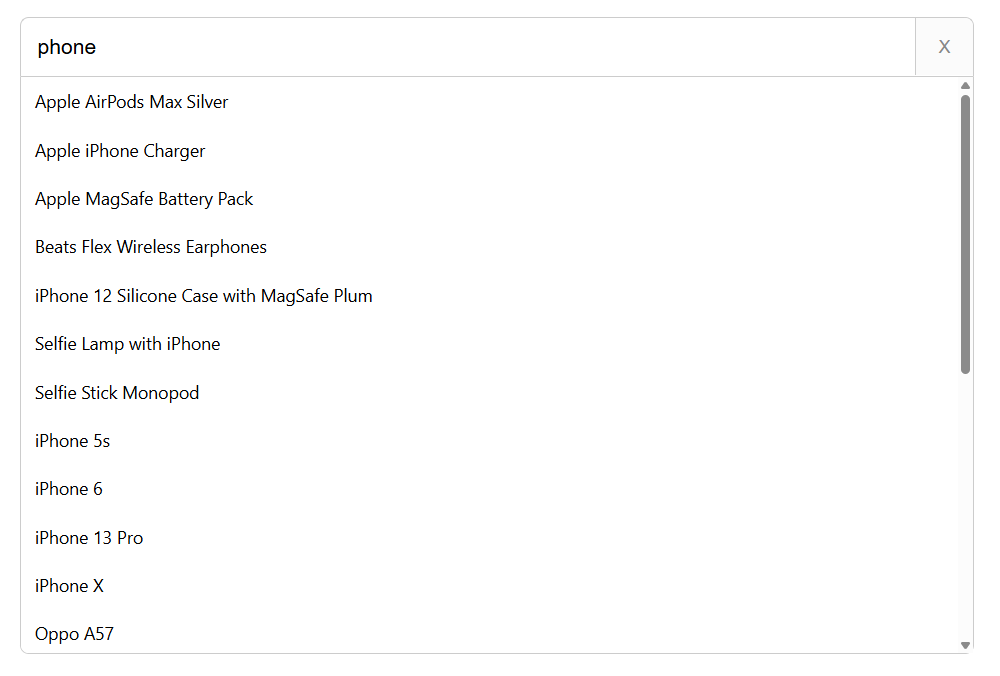
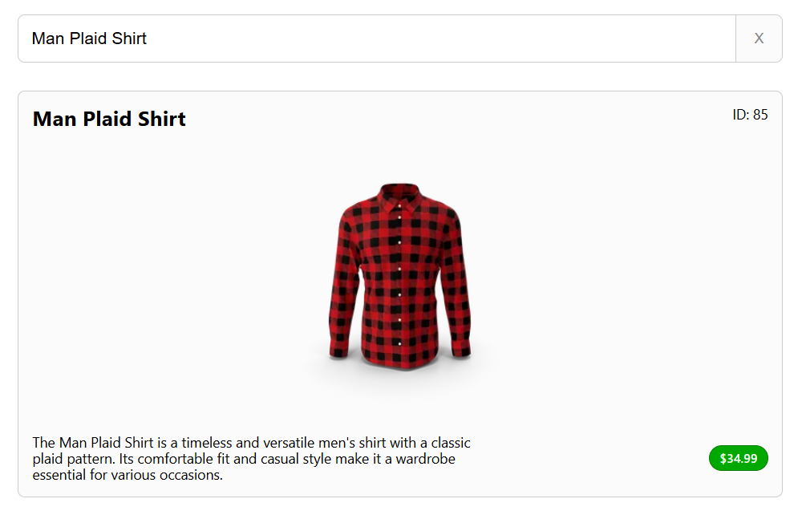

# Angular.JS Autocomplete

An autocomplete component implemented with Angular.JS.

See a [live demo](https://matthewwid.github.io/angularjs-autocomplete/) and [the source code](https://github.com/MatthewWid/angularjs-autocomplete/tree/master/src/app/autocomplete).

<p align="center">
    
    
</p>

Type-safe, accessible, mobile-friendly and keyboard navigable.

Use arrow keys to scroll through results, Enter to select and Escape to close.

## Installation

Install with any package manager:

```bash
npm install @mwid/angularjs-autocomplete
```

```bash
pnpm add @mwid/angularjs-autocomplete
```

```bash
yarn add @mwid/angularjs-autocomplete
```

## Usage

Import the module and register it as a dependency in your application:

```typescript
import { autocompleteModule } from "@mwid/angularjs-autocomplete"

angular.module("myApp", [autocompleteModule.name])
```

Add the component into your template, providing the minimally required inputs:

```html
<autocomplete
    options="$ctrl.options"
    on-fetch="$ctrl.onFetch"
    on-select="$ctrl.onSelect"
    on-close="$ctrl.onClose"
></autocomplete>
```

### Inputs

Inputs are fully type-safe:

```typescript
import type { AutocompleteInputs } from "@mwid/angularjs-autocomplete"
```

They are as follows:

| Name | Type | Required (Default) | Description |
|-|-|-|-|
| `options` | `AutocompleteOption[]` | Yes | The list of options to display in the dropdown. |
| `onFetch` | `(query: string) => Promise<void>` | Yes | Fetch a list of suggestions to populate `options` with. |
| `onSelect` | `(option: AutocompleteOption) => void` | Yes | Callback when an option is selected. |
| `onClose` | `() => void` | Yes | Callback when the options list is closed. |
| `inputId` | `string` | No (`autocomplete-input`) | ID of the [input](https://developer.mozilla.org/en-US/docs/Web/HTML/Reference/Elements/input) element. |
| `inputPlaceholder` | `string` | No (`Search...`) | [Placeholder](https://developer.mozilla.org/en-US/docs/Web/HTML/Reference/Attributes/placeholder) text for the input element. |

Remember that inputs are camel-cased in TypeScript and kebab-cased in templates.  
Eg, `onFetch` translates to `on-fetch` when used in a template.

`AutocompleteOption` has the following structure:

```typescript
{
    id: number;
    title: string;
}
```

## Technologies

* [Angular.JS](https://angularjs.org/) for user interface interactivity
* [TypeScript](https://www.typescriptlang.org/) for type safety
* [SASS](https://sass-lang.com/) for styling
* [DummyJSON](https://dummyjson.com/) for mock data
* [Vite](https://vitejs.dev/) for development and bundling
* [Biome](https://biomejs.dev/) for linting and formatting
* [pnpm](https://pnpm.io/) for dependency management
* [GitHub Actions](https://github.com/features/actions) for automated deployment
* [GitHub Pages](https://pages.github.com/) for hosting of live demo

## Development

Install Node, pnpm and dependencies:

```bash
curl -L https://git.io/n-install | bash
n auto
npm i -g pnpm
pnpm i
```

Run development server:

```bash
pnpm dev
```

Build for deployment:

```bash
pnpm build
```

## License

This project is licensed under the [MIT license](https://opensource.org/license/mit/).
